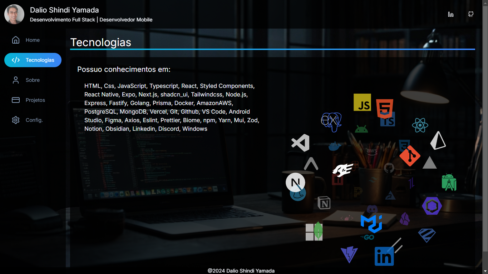
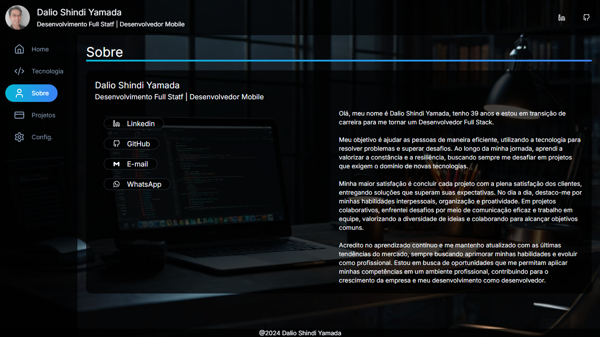
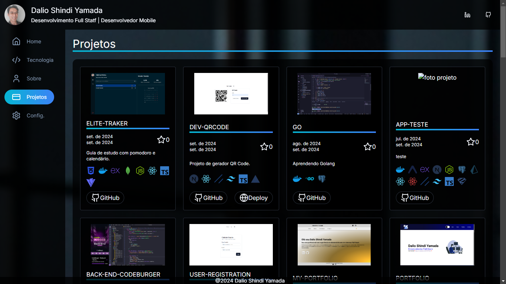
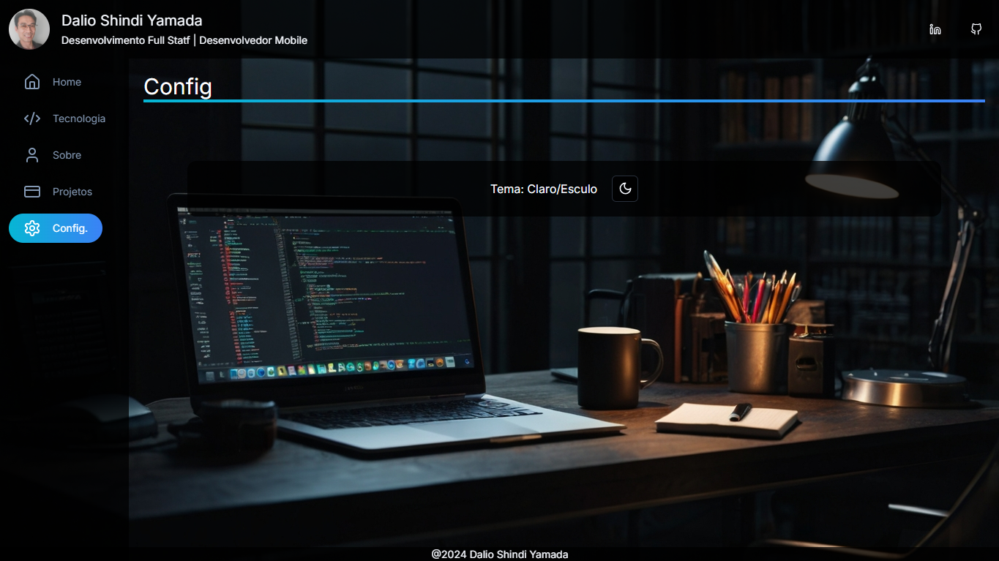

# Portfólio Dalio

## Índice

- [Visão Geral](#visão-geral)
  - [Imagens](#Imagens)
- [Funcionalidades](#funcionalidades)
- [Tecnologias Utilizadas](#tecnologias-utilizadas)
- [Começando](#começando)
  - [Pré-requisitos](#pré-requisitos)
  - [Instalação](#instalação)
  - [Executando o Projeto](#executando-o-projeto)
- [Contribuindo](#contribuindo)
- [Contato](#contato)

## Visão Geral

Criei meu novo portfólio do zero, utilizando meus conhecimentos mais recentes e me desafiando a desenvolver as aplicações da forma que considero mais eficiente. O grande diferencial deste portfólio é a integração com a API do GitHub, permitindo que meus projetos sejam automaticamente atualizados à medida que faço alterações nos repositórios, garantindo que ele esteja sempre atualizado com meus últimos trabalhos.

## Imagens

Aqui estão algumas imagens do projeto:

<div>
    
    
    
    
    
</div>

## Funcionalidades

- Atualização Automática de Projetos
- Apresentação de Projetos Recentes
- Interface Otimizada e Responsiva
- Organização Eficiente
- Tecnologias Modernas
- Experiência de Usuário Focada na Simplicidade

## Tecnologias Utilizadas

- [Next.js](https://nextjs.org/)
- [Tailwindcss](https://tailwindcss.com/)
- [shadcn_ui](https://ui.shadcn.com/)
- [Vercel](https://vercel.com/)

## Começando

### Pré-requisitos

- Node.js (v14.x ou superior)
- npm

### Instalação

1. Clone o repositório:

   ```bash
   git clone https://github.com/DalioSY/portfolio-next
   ```

2. Navegue até o diretório do projeto:

   ```bash
   cd portfolio-next
   ```

3. Instale as dependências:

   ```bash
   npm install
   ```

4. Adicione o token do GitHub no arquivo `.env`:

   No diretório raiz do projeto, crie um arquivo `.env` (se ainda não existir) e adicione a seguinte variável de ambiente, substituindo `<seu_token>` pelo seu token de acesso pessoal do GitHub:

   ```bash
   NEXT_PUBLIC_GITHUB_TOKEN=<seu_token>
   ```

### Executando o Projeto

Inicie o servidor de desenvolvimento:

```bash
npm run dev
```

## Contribuindo

Contribuições são bem-vindas! Por favor, siga estas etapas para contribuir:

1. Faça um fork do repositório.
2. Crie uma nova branch (`git checkout -b feature/SuaFuncionalidade`).
3. Faça suas alterações.
4. Faça um commit das suas alterações (`git commit -m 'Adicionei uma nova funcionalidade'`).
5. Envie para a branch (`git push origin feature/SuaFuncionalidade`).
6. Crie um novo Pull Request.

## Contato

**Dalio Shindi Yamada**

- [GitHub](https://github.com/DalioSY)
- [LinkedIn](https://www.linkedin.com/in/dalio-s-yamada)
